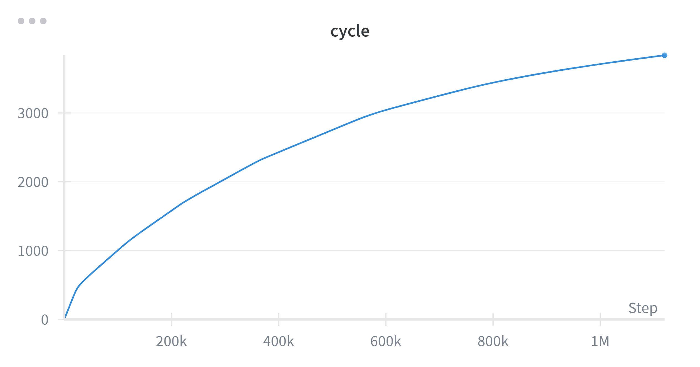

# veritas

## About

Veritas is a sandbox playground for developing, integrating, and testing robotic platforms.

It uses [Gensis](https://github.com/Genesis-Embodied-AI/Genesis) as the backend for the simulation environment.

Also utilizing WandB for experiment tracking. It does require an account but it is free

## Setup

1. Clone the repository

2. Install Genesis and its dependencies. Ensure torch is installed properly. Refer to the [Genesis installation guide]()

3. Install W&B: `pip install wandb`  
   Log into W&B: `wandb login` and follow the prompts to authenticate your account.

## Sampling

Points for sampling are generated using the `sample_point` function in `utils.py`. This samples points within a spherical shell and outside a cylinder, maintaining a range inside of the physical reach of the robot arm. The range sampling is done to ensure the IK solver has an optimal solution for any point so the mean time calculation for the IK solver is not skewed by points that are out of reach where the solver has to iterate util it hits the max iteration limit.

## Reward Function

The reward is calculated based on the difference of angles between the IK model joints and the NN model joints output, with a bonus based on the distance to the target point.

# IK Solver

The default solver for genesis is being utilized. It obtains roughly a mean error of 0.0110m and a standard deviation of 0.0187m.

## Approach and Results

### Training attempt 1

First training method used was simply getting the model's joint angles, and would sample a random point from a gaussian distribution using the model's joint output as the mean. It would then propagate the loss through the network based on the reward function to improve the model. The results are as follows:

Steps | Mean Error (m) | Standard Deviation (m)
----------- | ----------------- | ------------------
1,000 | 0.8808 | 0.2668
10,000 | 0.7251 | 0.2344
100,000 | 0.5594 | 0.2394

While this shows some improvement with increased steps, the model still has a high error rate and a quite shallow learning curve for the number of training steps. I am only testing with my physical hardware at home, so focusing on optimizing the training loop should be the next step.

### Training attempt 2

The next approach for training is utilizing a modified Curriculum learning approach. I believe this will help the model learn more effectively as it will be able to learn each point before moving onto the next. The goal is to train it on a specific buffer of points, that starts at size 1, and increments once the model can reach a certain performance threshold on the current buffer. The first run was allowed to save off the model every time it completed 10,000 steps, but this was later changed to only save when the buffer size was increased.  This led to a model that sovled 9 seprate points in less than 400k steps, but couldn't solve 10 in over 4M steps. The second and third run do not make it to 10 values in the buffer, but have some crazy diverging occuring with the loss function going all the way past 10,000 in some cases. The results are as follows:

Steps | Total Buffer Size | Mean Error (m) | Standard Deviation (m)
----------- | ----------------- | ------------------ | ------------------
4,000,000 | 10 | 0.5113 | 0.2859
1,000,000 | 8 | 0.4689 | 0.2910
300,000 | 7 | 0.4971 | 0.2086

With the base curriculum learning approach, the model is able to get to a lower mean error, however suffered from a high standard deviation in most cases. The loss diverging instead of converging is a concern, but this method has brought more unknowns then answers for the next step. 

### Training attempt 3

This appoach is very similar to v2, but with a more gradual approach to the curriculum learning. Instead of sampling a random point anywhere, it samples a point a random disatnce away from the previous target point within a small threshold. This is to help the model learn with less extreme joint movements until it can sample more points. The second thing that is added is an increasing in the reward threshold as the buffer size increases. This is to help the model progress through the curriculum and learn a more generalized solution. Lastly logging for the list of active points in the buffer is added to help with post processing and analysis, along with a new onion like plot aiming to find convergence zones where the model has been specifically trained on. This method has three main issues - 1: there are cases where the system will diverge and the loss will go through the roof, taking nearly half a million steps to recover. 2: This approach is not scalable. As the model approaches a buffer of 1000 elements, it quickly becomes clear that running it across all 1000 elements takes a significant amount of time. This can be easily visualized in the plot below as the steps run with consistent timing, where cycle is a function of running through the buffer. This indicates an exponential impact as the buffer is increased to better train the model.  3: The model seems to hit a wall at around 0.5m mean error and struggles to get lower. 

Steps | Total Buffer Size | Mean Error (m) | Standard Deviation (m)
----------- | ----------------- | ------------------ | ------------------
1,200,000 | 1,000 | 0.5029 | 0.2077

### Notes for next iteration
- Curriculum learning had an apparent improvment learning at the start of the model training, but seemed hit a wall. Other methods such as batching should be explored.
- Reward normilization should be explored to help with the diverging loss.
